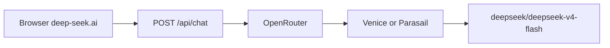

# deep-seek.ai Model Attribution (Read-Only OSINT)

| Field | Value |
| --- | --- |
| Target | https://deep-seek.ai/ru/ |
| Chat | https://deep-seek.ai/chat |
| Mode | Read-only / no exploit |
| Artifact | [deep-seek-ai-model-osint.json](./deep-seek-ai-model-osint.json) · [artifacts/deep-seek-ai-model-osint.json](../../artifacts/deep-seek-ai-model-osint.json) |
| Date | 2026-07-18 |
| Confidence | High |

**Policy:** passive HTTP/DNS inspection and a single canary chat completion to read SSE metadata. No credential stuffing, no scanning beyond the public chat flow, no exploitation.

## Verdict

**Default model is `deepseek/deepseek-v4-flash` (DeepSeek-V4-Flash), proxied via OpenRouter.**

This is **not** the official DeepSeek product (`chat.deepseek.com` / `deepseek.com`). `deep-seek.ai` is a third-party freemium chat mirror (Laravel/PHP + React) that brands itself as DeepSeek and monetizes via AdSense + PRO upsells (`maxgpt.ru`, Telegram `DeepGPT_Chatbot`).

OpenRouter may route the same model id through different upstream providers. Observed in this investigation:

| Probe | `model` | `provider` |
| --- | --- | --- |
| Earlier | `deepseek/deepseek-v4-flash` | Venice |
| Confirm capture | `deepseek/deepseek-v4-flash` | Parasail |

Marketing “DeepSeek-V4” maps to **Flash**, not official **V4-Pro**.

## Evidence

### 1. UI model config (`window.__CHAT_MODELS__`)

| UI label | OpenRouter-style id | slug |
| --- | --- | --- |
| DeepSeek-V4 (default) | `deepseek/deepseek-v4-flash` | `deepseek` |
| DeepSeek-R1 | `deepseek/deepseek-r1` | `deepseek-v3` |
| DeepSeek-V3 | `deepseek/deepseek-v3.2` | `deepseek-r1` |

Slug labels are swapped between R1 and V3 — cosmetic routing only. Trust the `id` / SSE `model` field.

### 2. Live SSE from `POST /api/chat`

- Stream comments: `: OPENROUTER PROCESSING`
- Chunk fields: `"model":"deepseek/deepseek-v4-flash"`, `"provider":"<OpenRouter upstream>"`
- Canary reply: `PING-OK`
- Frontend (`/chatapp/chat-app.js`) posts `{ model, messages }` with CSRF

### 3. Stack / brand signals

- `Server: nginx`, `X-Powered-By: PHP/8.2.x`, cookies `deepseek_session` + `XSRF-TOKEN`
- White-label chat template (fallback MODELS include `openai/gpt-4o*`; site name still “DeepSeek”)
- Google AdSense + GA; RU promo blocks point at maxgpt / DeepGPT bots with `utm_source=chatgptorg`

## Risks (disclosure)

- Brand mimicry of official DeepSeek; users may believe traffic stays with DeepSeek AI.
- Prompts leave the browser to a third-party backend, then OpenRouter and a rotating upstream.
- “Unlimited free” marketing conflicts with daily limit / PRO upsell UX (HTTP 429 path in client).
- Do not treat UI card names as authoritative without checking SSE `model`.

## Remediation (users / operators)

1. Prefer official channels: `chat.deepseek.com` or `api.deepseek.com` with `deepseek-v4-flash` / `deepseek-v4-pro`.
2. Do not send secrets, keys, or PII to mirror/aggregator sites.
3. If attributing a conversation for IR: capture SSE `model` + `provider` + request id from the stream.

## Official references

- DeepSeek V4 preview release: https://api-docs.deepseek.com/news/news260424
- Transparency center: https://www.deepseek.com/en/transparency/
