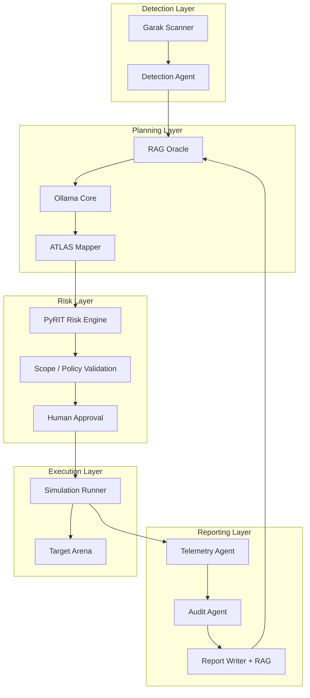

# ADR-003: Red Team Tools Integration (PyRIT, Garak, MITRE ATLAS)

## Status

Accepted

## Date

2026-07-16

## Context

Samson SBM is a managed purple-team laboratory for AI security testing. ADR-002 established RAG as the contextual memory and explainability layer. This ADR defines how three industry-standard AI red-team frameworks integrate into Samson SBM:

| Tool | Origin | Primary role in Samson SBM |
|---|---|---|
| **Microsoft PyRIT** | Microsoft AI Red Team | Risk scoring and scenario safety evaluation before execution |
| **Garak** | NVIDIA / open-source community | LLM vulnerability scanning for Ollama Core and agent models |
| **MITRE ATLAS** | MITRE Corporation | Taxonomy for tactics, techniques, and reporting (TTP/IOC mapping) |

These tools do not replace Samson SBM components — they **augment** them with standardized risk assessment, model safety testing, and adversarial-AI taxonomy. Samson SBM remains a **controlled simulation lab** with scope enforcement, human approval, and audit trails (see ADR-002).

### Problem statement

Without standardized tooling:

- Scenario risk is assessed ad hoc, inconsistently across operators
- Ollama Core and agent models are not systematically probed for jailbreaks, injections, or data leakage
- Exercise reports lack a common TTP vocabulary for purple-team retrospectives and blue-team handoff

### Relationship to prior decisions

- **ADR-002 (RAG)**: PyRIT and Garak findings are ingested into `samson/rag/docs/` after each scan cycle; ATLAS technique IDs are stored as metadata on exercise runs and citations
- **Platform guardrails**: PyRIT is a mandatory pre-execution gate; Garak runs on a schedule and on model version changes; ATLAS provides taxonomy only — it does not authorize execution

## Decision

Integrate PyRIT, Garak, and MITRE ATLAS as first-class modules under `samson/redteam/` and wire them into the Orchestrator workflow at defined control points.

### Directory layout

```text
samson/
  redteam/
  pyrit/
    risk_engine.py       # PyRIT wrapper: scenario risk scoring
    config.yaml          # PyRIT scorer profiles, thresholds
    reports/             # PyRIT scan outputs (JSON)
  garak/
    scanner.py           # Garak wrapper: model vulnerability probes
    probes/              # Custom probe definitions (arena-scoped)
    reports/             # Garak scan outputs (JSONL)
  atlas/
    taxonomy.json        # Cached ATLAS technique subset (versioned)
    mapper.py            # Scenario/telemetry → ATLAS technique IDs
    reports/             # ATLAS-mapped exercise summaries
  schemas.py             # Shared Pydantic models for all three tools
  orchestrator_hooks.py  # Entry points called by Samson Orchestrator
```

### Layer mapping in Samson SBM

```text
┌─────────────────────────────────────────────────────────────────┐
│                     Samson Orchestrator                          │
├──────────────┬──────────────────┬───────────────────────────────┤
│  PyRIT       │  Garak           │  MITRE ATLAS                  │
│  Risk Engine │  Detection Agent │  Scenario / Telemetry Taxonomy│
├──────────────┼──────────────────┼───────────────────────────────┤
│  Pre-run     │  Model health    │  Scenario design + reporting  │
│  risk gate   │  scanning        │  TTP/IOC mapping              │
└──────────────┴──────────────────┴───────────────────────────────┘
         │                │                        │
         v                v                        v
   Policy Gate      Ollama Core / Agents     RAG Oracle (ADR-002)
   Human Approval   Target Arena             Report Writer
```

### End-to-end workflow



Ordered control flow:

```text
1. Garak (scheduled / on model change) → Detection Agent → findings to RAG ingest
2. Detection Agent (runtime signal) → RAG Oracle (retrieve_context)
3. Ollama Core → Scenario Draft
4. ATLAS Mapper → assign technique IDs, tactics, mitigations to draft
5. PyRIT Risk Engine → score scenario; block / flag / pass
6. Scope / Policy Validation → arena-only, allowed techniques, time window
7. Human Approval → operator sign-off
8. Simulation Runner → Target Arena only
9. Telemetry Agent → collect observables
10. ATLAS Mapper → map telemetry to TTP/IOC
11. Audit Agent → immutable log
12. Report Writer → citations + ATLAS matrix + PyRIT score + Garak context
13. RAG Memory Update → ingest new report and findings
```

---

## Tool 1: Microsoft PyRIT — Risk Engine

### Role

PyRIT evaluates generative-AI risk **before** a scenario is approved. It scores prompt chains, agent behaviors, and scenario parameters against configured harm categories. It is a **mandatory gate** — scenarios below threshold or flagged as high-risk require elevated approval or are blocked.

### Integration point

Called by Orchestrator **after** Scenario Draft + ATLAS mapping, **before** Scope/Policy Validation.

### Module: `samson/redteam/pyrit/risk_engine.py`

#### API contract

```python
class PyRITRiskRequest(BaseModel):
    request_id: UUID
    scenario_id: str
    scenario_draft: dict          # Ollama-generated scenario JSON
    atlas_techniques: list[str]   # ATLAS technique IDs from mapper
    target_profile: dict          # Arena target metadata only
    environment: Literal["dev", "stage", "prod"]
    operator_id: str

class PyRITRiskResult(BaseModel):
    request_id: UUID
    risk_score: float             # 0.0 (low) – 1.0 (high)
    risk_band: Literal["low", "medium", "high", "critical"]
    harm_categories: list[str]    # e.g. jailbreak, data_exfil, harmful_content
    blocked: bool                 # True if score exceeds auto-block threshold
    requires_elevated_approval: bool
    rationale: str
    pyrit_report_path: str
    scanned_at: datetime
```

#### Thresholds (configurable in `config.yaml`)

| `risk_band` | Score range | Orchestrator action |
|---|---|---|
| `low` | 0.0 – 0.3 | Proceed to policy validation |
| `medium` | 0.3 – 0.6 | Proceed; flag in operator briefing |
| `high` | 0.6 – 0.8 | Require elevated approval |
| `critical` | 0.8 – 1.0 | Auto-block; operator may override with dual approval in prod |

#### Guardrails

- PyRIT runs **only** against scenario drafts and synthetic prompt chains — not live external targets
- Scenario text must reference Target Arena identifiers; external URLs are stripped before scoring
- All PyRIT invocations logged to `redteam_audit_log` (see schema below)
- PyRIT output is ingested into RAG as `doc_type: pyrit_report` for historical risk trends

---

## Tool 2: Garak — LLM Vulnerability Scanner

### Role

Garak probes Ollama Core and agent-facing models for known LLM failure modes: prompt injection, jailbreaks, hallucination triggers, data leakage patterns, and encoding attacks. It operates as the **Detection Agent** for model health, not for attacking external systems.

### Integration points

| Trigger | Scope |
|---|---|
| Scheduled (cron / K8s CronJob) | Full probe suite against Ollama endpoint |
| On model version change | Delta probe suite (fast subset) |
| Pre-exercise (optional dev) | Quick smoke probes before Simulation Runner |

### Module: `samson/redteam/garak/scanner.py`

#### API contract

```python
class GarakScanRequest(BaseModel):
    request_id: UUID
    model_endpoint: str         # Internal Ollama URL only (cluster DNS)
    model_name: str
    probe_suite: Literal["full", "fast", "custom"]
    environment: Literal["dev", "stage", "prod"]
    triggered_by: Literal["schedule", "model_change", "pre_exercise", "manual"]

class GarakScanResult(BaseModel):
    request_id: UUID
    scan_id: UUID
    model_name: str
    probes_run: int
    probes_failed: int
    hit_rate: float               # failed / run
    findings: list[GarakFinding]
    garak_report_path: str
    scanned_at: datetime

class GarakFinding(BaseModel):
    probe_name: str
    severity: Literal["info", "low", "medium", "high", "critical"]
    description: str
    evidence: str                 # Truncated probe output
    mitre_atlas_technique: str | None  # Cross-ref when applicable
```

#### Probe policy

- **Allowed targets**: Ollama Core, SBM agent LLM endpoints inside the cluster
- **Forbidden targets**: public APIs, production customer models, internet-facing endpoints
- Custom probes in `samson/redteam/garak/probes/` must declare `arena_scoped: true`
- Findings with `severity >= high` block pre-exercise smoke path until operator acknowledges

#### Guardrails

- Garak never scans outside the Samson SBM cluster network
- Reports ingested to RAG as `doc_type: garak_report`
- Detection Agent surfaces Garak findings to Orchestrator; does not auto-trigger Simulation Runner

---

## Tool 3: MITRE ATLAS — Taxonomy and Reporting

### Role

MITRE ATLAS (Adversarial Threat Landscape for AI Systems) provides the **tactics and techniques taxonomy** for AI-centric adversarial behavior. In Samson SBM it structures scenario design, telemetry mapping, and report output — enabling explainable purple-team exercises aligned with industry frameworks.

### Integration points

| Phase | Module | Action |
|---|---|---|
| Scenario drafting | `atlas/mapper.py` | Map scenario draft → ATLAS technique IDs |
| Pre-execution | Orchestrator | Attach technique metadata to PyRIT request |
| Post-execution | Telemetry Agent | Map observables → TTP / IOC |
| Reporting | Report Writer | Include ATLAS matrix section with mitigations |

### Module: `samson/redteam/atlas/mapper.py`

#### API contract

```python
class ATLASMapRequest(BaseModel):
    request_id: UUID
    artifact_type: Literal["scenario_draft", "telemetry", "garak_finding", "pyrit_report"]
    artifact: dict
    top_k: int = 5

class ATLASMapResult(BaseModel):
    request_id: UUID
    tactics: list[ATLASEntry]
    techniques: list[ATLASEntry]
    mitigations: list[str]
    confidence: float

class ATLASEntry(BaseModel):
    atlas_id: str                 # e.g. AML.T0051
    name: str
    description: str
    confidence: float
    evidence: str
```

#### Taxonomy cache

- `samson/redteam/atlas/taxonomy.json` — versioned subset of ATLAS techniques relevant to Samson SBM (LLM, agent, prompt, model evasion categories)
- Updated quarterly or on MITRE ATLAS release; `taxonomy_version` stored on every map result
- RAG indexes taxonomy entries as `doc_type: atlas_technique` for retrieval during scenario drafting

#### Guardrails

- ATLAS provides **classification and explainability only** — it does not authorize techniques or bypass approval gates
- Technique mapping is advisory; operator sees confidence scores and may reject mappings
- Reports include ATLAS IDs for blue-team handoff and remediation tracking

---

## Orchestrator hooks

`samson/redteam/orchestrator_hooks.py` exposes three functions called by Samson Orchestrator:

```python
def evaluate_scenario_risk(req: PyRITRiskRequest) -> PyRITRiskResult: ...
def scan_model_health(req: GarakScanRequest) -> GarakScanResult: ...
def map_to_atlas(req: ATLASMapRequest) -> ATLASMapResult: ...
```

Orchestrator decision matrix after hooks:

| PyRIT `blocked` | Garak pre-exercise | Policy | Result |
|---|---|---|---|
| `true` | any | any | **Block** — surface rationale to operator |
| `false` | `high` findings unacked | any | **Hold** — require operator acknowledgment |
| `false` | clean or acked | fail | **Block** — policy violation |
| `false` | clean or acked | pass | **Proceed** to Human Approval |

---

## Database extensions

Extends ADR-002 schema with red-team-specific tables.

### `redteam_scans`

| Column | Type | Notes |
|---|---|---|
| `scan_id` | UUID PK | |
| `tool` | TEXT | `pyrit`, `garak` |
| `request_id` | UUID | Orchestrator correlation |
| `run_id` | UUID FK | Nullable until exercise linked |
| `model_name` | TEXT | Garak only |
| `scenario_id` | TEXT | PyRIT only |
| `risk_score` | REAL | PyRIT only |
| `risk_band` | TEXT | PyRIT only |
| `hit_rate` | REAL | Garak only |
| `report_path` | TEXT | |
| `created_at` | TIMESTAMPTZ | |

### `atlas_mappings`

| Column | Type | Notes |
|---|---|---|
| `mapping_id` | UUID PK | |
| `run_id` | UUID FK → exercise_runs | |
| `atlas_id` | TEXT | e.g. AML.T0051 |
| `artifact_type` | TEXT | `scenario`, `telemetry`, `finding` |
| `confidence` | REAL | |
| `evidence` | TEXT | |
| `taxonomy_version` | TEXT | |
| `created_at` | TIMESTAMPTZ | |

### `redteam_audit_log`

Append-only log for all PyRIT, Garak, and ATLAS invocations (mirrors `rag_audit_log` pattern from ADR-002).

| Column | Type | Notes |
|---|---|---|
| `audit_id` | UUID PK | |
| `request_id` | UUID | |
| `tool` | TEXT | `pyrit`, `garak`, `atlas` |
| `operator_id` | TEXT | |
| `action` | TEXT | `risk_eval`, `scan`, `map` |
| `outcome` | TEXT | `pass`, `block`, `hold`, `error` |
| `payload_hash` | TEXT | SHA-256 of request (no secrets) |
| `duration_ms` | INT | |
| `created_at` | TIMESTAMPTZ | |

---

## Reporting format

Exercise reports (ADR-002 `write_report_context`) gain a **Red Team Tools** section:

```markdown
## Red Team Tools Summary

### PyRIT Risk Assessment
- Risk score: 0.42 (medium)
- Harm categories: prompt_injection, data_leakage
- Gate: passed with flag

### Garak Model Health (last scan: 2026-07-15)
- Model: llama3.2:latest
- Hit rate: 2.1% (3/142 probes)
- Open findings: 1 medium (encoding_attack)

### MITRE ATLAS Mapping
| Technique | Name | Confidence | Phase |
|---|---|---|---|
| AML.T0051 | LLM Prompt Injection | 0.87 | scenario |
| AML.T0043 | Craft Adversarial Data | 0.72 | telemetry |

### Remediation references
- [citation:chunk_id] ...
```

---

## Infrastructure placement (dev environment)

| Component | Deployment | Notes |
|---|---|---|
| PyRIT Risk Engine | K8s Job or Orchestrator sidecar | Invoked on-demand per scenario |
| Garak Scanner | K8s CronJob (weekly) + Job on model change | Isolated namespace `samson-redteam` |
| ATLAS Mapper | Orchestrator library (in-process) | No separate deployment |
| Reports | `samson/redteam/*/reports/` + S3 backup | Ingested to RAG post-scan |

Network policy for `samson-redteam` namespace:

- Egress: Ollama Core service only (cluster DNS)
- No egress to `0.0.0.0/0`
- Ingress: Orchestrator service account only

---

## Alternatives Considered

### Build custom risk scorer instead of PyRIT

- **Pros**: Full control, no external dependency
- **Cons**: Reinvents Microsoft's validated AI red-team methodology; slower to align with industry
- **Rejected**: PyRIT is the de facto standard for generative-AI risk identification

### Manual model testing instead of Garak

- **Pros**: No scanner infrastructure
- **Cons**: Not repeatable, not scalable, misses probe coverage
- **Rejected**: Garak provides systematic, versioned probe suites

### Custom TTP taxonomy instead of MITRE ATLAS

- **Pros**: Tailored to Samson SBM only
- **Cons**: No interoperability with blue-team tools, threat intel, or industry reports
- **Rejected**: ATLAS is the authoritative AI adversary framework

### Running PyRIT/Garak against production external models

- **Pros**: "Real-world" signal
- **Cons**: Violates scope enforcement; legal and operational risk
- **Rejected**: Arena-scoped and cluster-internal targets only

---

## Consequences

### Positive

- Standardized, repeatable AI red-team methodology across exercises
- PyRIT provides quantitative risk gate before any simulation
- Garak gives continuous model health signal for Ollama Core
- ATLAS enables explainable reports and blue-team handoff with industry vocabulary
- Findings flow into RAG (ADR-002) for institutional memory

### Negative / trade-offs

- PyRIT and Garak add latency to exercise setup (mitigated: Garak mostly async/scheduled)
- ATLAS taxonomy requires periodic manual updates to `taxonomy.json`
- Additional K8s namespace and CronJob maintenance in dev/prod

### Dependencies

| Package | Purpose | Pin strategy |
|---|---|---|
| `pyrit` | Risk Engine | Pin minor version; review release notes |
| `garak` | LLM Scanner | Pin probe suite version |
| MITRE ATLAS JSON | Taxonomy | Versioned file in repo, not pip |

### Follow-up work

1. Implement `samson/redteam/` modules per contracts above
2. Add SQL migrations for `redteam_scans`, `atlas_mappings`, `redteam_audit_log`
3. Wire `orchestrator_hooks.py` into Samson Orchestrator
4. Create K8s CronJob manifest for Garak scheduled scans
5. Seed `atlas/taxonomy.json` with initial ATLAS technique subset
6. Integration test: scenario draft → PyRIT → ATLAS map → mock approval → report with all three sections

---

## References

- ADR-002: RAG Architecture for Samson SBM (`docs/decisions/002-rag-architecture.md`)
- Microsoft PyRIT: https://github.com/Azure/PyRIT
- Garak LLM Scanner: https://github.com/NVIDIA/garak
- MITRE ATLAS: https://atlas.mitre.org/
- MITRE ATLAS Techniques: https://atlas.mitre.org/techniques/
