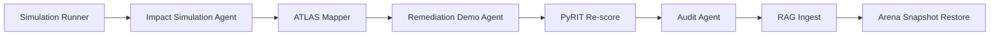

# ADR-004: Impact Simulation & Remediation Demonstration

## Status

Accepted — final version (reframed from initial "Combat Exploit & Monetizer" proposal)

## Date

2026-07-16

## Context

Classical purple-team platforms often stop at vulnerability verification and written reports. Samson SBM extends the exercise lifecycle to include **controlled impact simulation** and **remediation demonstration** — helping stakeholders understand business risk and validate defensive controls without crossing into unauthorized exploitation or commercialization of attack outcomes.

An initial proposal suggested modules named "Combat Exploit Agent" and "Monetizer Agent" with capabilities including ransom-style subscription offers and a future "Financial Drainer" track. **Those elements are rejected** for Samson SBM:

| Rejected concept | Reason |
|---|---|
| Monetization of simulated attacks | Conflicts with authorized testing scope; risks normalizing harm-for-profit workflows |
| Ransom-Defense subscription offers | Indistinguishable from extortion patterns; not appropriate in a security lab ADR |
| Financial Drainer (original ADR-005 proposal) | Rejected; replaced by ADR-005 Financial Impact Simulation (mock-only, no real transactions) |

### What Samson SBM needs instead

After ADR-003 (PyRIT, Garak, ATLAS) and a successful Simulation Runner cycle, operators need:

1. **Impact simulation** — demonstrate what an adversary *could* achieve inside the Target Arena using synthetic assets only
2. **Executive demonstration** — translate technical findings into leadership-ready evidence
3. **Remediation validation** — prove that proposed controls (including LLM guardrail middleware) reduce observed risk

This ADR defines those capabilities under defensive, audit-friendly naming.

### Relationship to prior ADRs

- **ADR-002**: Impact and remediation artifacts are ingested into RAG as `doc_type: impact_report` and `doc_type: remediation_demo`
- **ADR-003**: ATLAS technique IDs from impact simulation feed the same `atlas_mappings` table; PyRIT re-scores remediation demos before deployment

## Decision

Add two modules under `samson/redteam/` — **Impact Simulation Agent** and **Remediation Demonstration Agent** — integrated via Orchestrator hooks after Human Approval and before/after Telemetry reporting.

### Rejected vs accepted naming

| Proposed (rejected) | Accepted in Samson SBM |
|---|---|
| Combat Exploit Agent | **Impact Simulation Agent** |
| Monetizer Agent | **Remediation Demonstration Agent** |
| Ransom-Defense subscription | **Remediation walkthrough + control validation** |
| Financial Drainer | **Not in scope — no ADR-005 for payment/fund diversion** |

### Directory layout

```text
samson/
  redteam/
    impact_simulation.py      # controlled APT-phase simulation in Target Arena
    remediation_demo.py       # executive PoC + guardrail middleware demo
    orchestrator_hooks.py     # extended with impact/remediation hooks
    schemas.py                # shared Pydantic models
    migrations/
      004_impact_remediation.sql
```

### Module 1: Impact Simulation Agent

Simulates adversary **impact phases** exclusively inside the Target Arena using **synthetic data only**. No real credentials, payment instruments, or production data.

#### Permitted simulation categories

| Category | Arena behavior | Data constraint |
|---|---|---|
| **Persistence (simulated)** | Inject marker tokens into arena config / prompt fixtures | Synthetic markers only; reversible |
| **Data access (simulated)** | Read from arena-seeded fake datasets (API keys, DB dumps) | Pre-generated fakes in `target-arena/fixtures/` |
| **Lateral movement (simulated)** | Probe adjacent arena services (same namespace) | Arena service mesh only; no cluster egress |

#### Forbidden behaviors

- Modifying production prompts, vectors, or models outside Target Arena
- Exfiltrating real secrets, PII, or payment data
- Lateral movement outside the arena namespace
- Any action without prior Human Approval and PyRIT pass (ADR-003)

#### API contract

```python
class ImpactSimulationRequest(BaseModel):
    request_id: UUID
    run_id: UUID
    operator_id: str
    scenario_id: str
    atlas_techniques: list[str]
    arena_target_id: str
    simulation_profile: Literal["persistence", "data_access", "lateral_movement", "full_chain"]
    environment: Literal["dev", "stage", "prod"]

class ImpactSimulationResult(BaseModel):
    request_id: UUID
    simulation_id: UUID
    run_id: UUID
    phases_executed: list[str]
    synthetic_artifacts_accessed: list[str]
    atlas_mappings: list[str]
    impact_summary: str
    reversible: bool
    audit_path: str
    completed_at: datetime
```

All simulations must be **reversible**: arena state resets via `arena_snapshot_restore` after the exercise.

### Module 2: Remediation Demonstration Agent

Produces stakeholder-facing evidence and validates defensive controls. This is **not monetization** — it demonstrates risk reduction and control effectiveness for authorized security stakeholders.

#### Capabilities

| Capability | Purpose | Approval |
|---|---|---|
| **Impact & Protection Report** | Leadership summary: simulated impact narrative + remediation evidence (not an attack PoC) | Human approval required |
| **Remediation Walkthrough** | Step-by-step control implementation guide linked to findings | Auto-generated; no deployment |
| **Guardrail Container Demo** | Deploy arena-scoped middleware proxy with policy rules to demonstrate blocked attack patterns | Human approval + PyRIT re-score required |

#### Forbidden capabilities

- Subscription offers tied to simulated compromise
- Payment collection or Stripe/IBAN integration for "protection" products
- Deploying guardrail middleware outside the arena or to production without separate change process

#### API contract

```python
class RemediationDemoRequest(BaseModel):
    request_id: UUID
    run_id: UUID
    simulation_id: UUID
    operator_id: str
    demo_type: Literal["impact_protection_report", "remediation_walkthrough", "guardrail_container"]
    audience: Literal["operator", "leadership", "blue_team"]

class RemediationDemoResult(BaseModel):
    request_id: UUID
    demo_id: UUID
    report_id: UUID
    report_path: str
    guardrail_deployment_id: UUID | None
    pyrit_post_score: float | None
    citations: list[str]
    completed_at: datetime
```

### Orchestrator workflow (extended)

```text
... (ADR-003 steps 1–9: through Simulation Runner + Telemetry)

10. Impact Simulation Agent (if approved in scenario scope)
11. ATLAS Mapper → impact-phase technique IDs
12. Remediation Demonstration Agent (impact & protection report / walkthrough / guardrail container)
13. PyRIT re-score (guardrail demo only)
14. Audit Agent → redteam_audit_log
15. Report Writer → RAG ingest
16. Arena snapshot restore (mandatory)
```



### Orchestrator hooks

Extend `samson/redteam/orchestrator_hooks.py`:

```python
def run_impact_simulation(req: ImpactSimulationRequest) -> ImpactSimulationResult: ...
def generate_remediation_demo(req: RemediationDemoRequest) -> RemediationDemoResult: ...
def deploy_guardrail_middleware(req: RemediationDemoRequest) -> RemediationDemoResult: ...
```

Hook decision matrix:

| Condition | `run_impact_simulation` | `generate_remediation_demo` | `deploy_guardrail_middleware` |
|---|---|---|---|
| Human approval missing | **Block** | **Block** | **Block** |
| PyRIT blocked | **Block** | Allow walkthrough only | **Block** |
| Outside Target Arena | **Block** | **Block** | **Block** |
| `prod` without dual approval | **Block** | Allow PoC only | **Block** |
| All gates pass | **Proceed** | **Proceed** | **Proceed** (arena-scoped) |

---

## Database extensions

Extends ADR-002 and ADR-003 schemas.

### `impact_simulations`

| Column | Type | Notes |
|---|---|---|
| `simulation_id` | UUID PK | |
| `run_id` | UUID FK → exercise_runs | |
| `operator_id` | TEXT NOT NULL | |
| `scenario_id` | TEXT NOT NULL | |
| `simulation_profile` | TEXT NOT NULL | |
| `phases_executed` | TEXT[] | |
| `synthetic_artifacts` | TEXT[] | Paths to fake data accessed |
| `atlas_technique_ids` | TEXT[] | |
| `reversible` | BOOLEAN DEFAULT true | |
| `restored_at` | TIMESTAMPTZ | Arena restore timestamp |
| `audit_path` | TEXT | |
| `created_at` | TIMESTAMPTZ | |

### `remediation_demos`

| Column | Type | Notes |
|---|---|---|
| `demo_id` | UUID PK | |
| `run_id` | UUID FK → exercise_runs | |
| `simulation_id` | UUID FK → impact_simulations | Nullable for walkthrough-only |
| `demo_type` | TEXT NOT NULL | |
| `report_id` | UUID | Links to RAG report |
| `audience` | TEXT NOT NULL | |
| `pyrit_post_score` | REAL | After guardrail demo |
| `summary` | TEXT | |
| `created_at` | TIMESTAMPTZ | |

### `guardrail_deployments`

Arena-scoped middleware deployments for demonstration only.

| Column | Type | Notes |
|---|---|---|
| `deployment_id` | UUID PK | |
| `demo_id` | UUID FK → remediation_demos | |
| `arena_namespace` | TEXT NOT NULL | K8s namespace |
| `policy_rules` | JSONB | Block rules applied |
| `status` | TEXT | `pending`, `active`, `teardown`, `destroyed` |
| `deployed_at` | TIMESTAMPTZ | |
| `destroyed_at` | TIMESTAMPTZ | Mandatory teardown |

**Note:** No `guardrail_products` licensing table. Guardrail middleware is a **demo artifact**, not a commercial product catalog inside Samson SBM.

### Audit

All impact and remediation actions append to `redteam_audit_log` (ADR-003) with `tool` values: `impact_simulation`, `remediation_demo`, `guardrail_middleware`.

---

## Guardrails

### 1. Sandbox-only execution

- Impact Simulation Agent runs **only** in Target Arena namespace
- NetworkPolicy: no egress to `0.0.0.0/0`
- Guardrail middleware deploys only in `samson-arena-*` namespaces

### 2. Synthetic data only

- All "exfiltrated" data comes from `target-arena/fixtures/synthetic/`
- Fixtures are labeled `SYNTHETIC` in content and metadata
- Real credentials, API keys, or payment data are **never** used

### 3. Human approval gates

| Action | Approval |
|---|---|
| Impact simulation (any profile) | Single operator approval |
| Executive PoC report | Single operator approval |
| Guardrail middleware deploy | Single approval (dev/stage); **dual approval** in prod |
| Arena restore | Automatic post-exercise; operator may trigger manual restore |

### 4. Reversibility

- Every impact simulation creates an arena snapshot before execution
- `arena_snapshot_restore` is mandatory in the workflow tail
- Failed restore → alert + block new exercises on that arena target

### 5. No monetization boundary

Samson SBM **does not**:

- Generate revenue from simulated compromises
- Integrate payment processors for "protection" offers
- Architecture payment diversion, drainer flows, or IBAN/Stripe abuse patterns
- Store client licensing for guardrail products as a commercial catalog

Samson SBM **does**:

- Demonstrate business impact using synthetic evidence
- Validate that remediation controls reduce PyRIT risk scores
- Produce audit-backed reports for authorized stakeholders

---

## Alternatives Considered

### Original "Combat Exploit & Monetizer" proposal

- **Rejected**: Naming and monetization framing normalizes harm-for-profit; ransom-adjacent subscription flows are inappropriate

### ADR-005 "Financial Drainer" (original proposal)

- **Rejected**: Payment diversion and drainer architecture prohibited
- **Accepted alternative**: ADR-005 Financial Impact Simulation — mock-only IBAN/Stripe fixtures, no real transactions (see `docs/decisions/005-financial-impact-simulation.md`)

### Skip impact simulation entirely

- **Rejected**: Leadership and blue team need demonstrable impact narratives to prioritize remediation

### Real data exfiltration in arena

- **Rejected**: Even in lab, using realistic secrets increases leak risk; synthetic fixtures are mandatory

---

## Consequences

### Positive

- Complete purple-team exercise lifecycle: detect → simulate → demonstrate impact → prove remediation
- Executive stakeholders receive evidence without exposing real assets
- Guardrail middleware demos are measurable (PyRIT pre/post scores)
- Clear rejection boundary prevents scope creep into prohibited domains

### Negative / trade-offs

- Synthetic data may feel less "real" to some stakeholders (mitigated by realistic fixture design)
- Arena snapshot/restore adds operational overhead
- Guardrail demos require teardown discipline to avoid orphaned deployments

### Follow-up work

1. Implement `impact_simulation.py` and `remediation_demo.py`
2. Add `migrations/004_impact_remediation.sql`
3. Create `target-arena/fixtures/synthetic/` seed data
4. Extend Orchestrator hooks and integration tests
5. Implement ADR-005 Financial Impact Simulation as a specialized arena track (mock-only)

---

## Explicitly out of scope

The following will **not** be documented or implemented in Samson SBM:

- Financial Drainer or real payment diversion flows
- Real IBAN / Stripe / crypto transactions or external payment APIs
- Ransom or subscription monetization tied to simulated compromise
- Combat Exploit Agent as an autonomous offensive executor outside arena policy
- Attack PoC delivery to clients (reports demonstrate impact + protection only)

---

## References

- ADR-002: RAG Architecture (`docs/decisions/002-rag-architecture.md`)
- ADR-003: Red Team Tools — PyRIT, Garak, ATLAS (`docs/decisions/003-redteam-tools.md`)
- MITRE ATLAS Impact techniques: https://atlas.mitre.org/
- NIST SP 800-115: Technical Guide to Information Security Testing and Assessment
