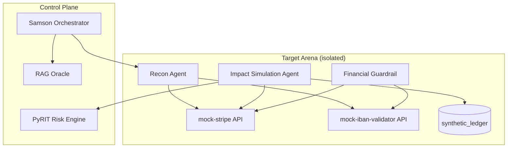

# ADR-005: Financial Impact Simulation

## Status

Accepted

## Date

2026-07-16

## Context

Samson SBM ADR-004 established **Impact Simulation** and **Remediation Demonstration** for general APT-phase outcomes in the Target Arena. Many organizations additionally need to understand **financial fraud and payment-substitution risk** — e.g. how an adversary might attempt to redirect invoices, swap IBAN details, or abuse payment APIs.

An initial proposal framed this as "Financial Drainer" with IBAN/Stripe integration. **That framing is rejected.** Samson SBM does not architect fund diversion, real payment processing, or drainer workflows.

This ADR defines **Financial Impact Simulation**: a sandbox-only track that demonstrates financial attack *patterns* using **mock APIs and synthetic fixtures**, then immediately demonstrates **Financial Guardrail** controls that block those patterns.

### Relationship to prior ADRs

| ADR | Relationship |
|---|---|
| ADR-002 (RAG) | Financial simulation reports ingested as `doc_type: financial_impact_report` |
| ADR-003 (PyRIT/Garak/ATLAS) | PyRIT scores financial scenarios; ATLAS maps fraud TTPs; Garak may probe LLM agents handling payment prompts |
| ADR-004 (Impact Simulation) | Financial track is a specialized `simulation_profile: financial_impact` extension of Impact Simulation |

### Problem statement

Without a financial simulation track:

- Leadership underestimates payment-substitution and invoice-fraud risk
- Blue team lacks measurable evidence that financial guardrails work
- LLM agents handling payment instructions are not tested in a controlled fraud context

## Decision

Add two modules under `samson/redteam/`:

1. **Financial Sandbox** (`financial_sandbox.py`) — mock IBAN/Stripe API environment inside Target Arena
2. **Financial Guardrail** (`financial_guardrail.py`) — middleware demonstrating detection and blocking of payment-substitution patterns

Recon and Impact agents interact **only** with mock endpoints. No real transactions, no external payment APIs, no production credentials.

### Rejected vs accepted

| Rejected | Accepted in Samson SBM |
|---|---|
| Financial Drainer | **Financial Impact Simulation** |
| Real Stripe/IBAN API calls | **Mock payment API** (`mock-stripe`, `mock-iban` services in arena) |
| Fund diversion / withdrawal flows | **Synthetic transaction ledger** with fake balances |
| Monetization of simulated fraud | **Impact + protection report** for authorized stakeholders |

### Directory layout

```text
samson/
  redteam/
    impact_simulation.py       # ADR-004; extended with financial_impact profile
    remediation_demo.py        # ADR-004
    financial_sandbox.py       # mock payment environment
    financial_guardrail.py     # payment-substitution protection demo
    orchestrator_hooks.py
    schemas.py
    migrations/
      004_impact_remediation.sql
      005_financial_simulation.sql
  target-arena/
    fixtures/
      financial/
        synthetic_ibans.json
        synthetic_stripe_objects.json
        mock_merchant_profiles.json
    services/
      mock-stripe/             # in-cluster mock API
      mock-iban-validator/     # in-cluster mock API
```

---

## Architecture



### Workflow

```text
1.  Operator defines financial scenario scope (allowed mock merchants, techniques)
2.  Human Approval + PyRIT risk gate
3.  Recon Agent → discovers mock payment endpoints in arena (mock-stripe, mock-iban)
4.  Impact Simulation Agent (profile: financial_impact)
      → simulates payment-substitution / invoice tampering against synthetic ledger
5.  ATLAS Mapper → fraud-related technique IDs
6.  Financial Guardrail → deploy arena middleware; re-run simulation (blocked)
7.  Remediation Demonstration Agent → impact & protection report
8.  RAG ingest → financial_impact_report
9.  Arena snapshot restore (mandatory)
```

---

## Module 1: Financial Sandbox

### Purpose

Provides an in-cluster mock payment environment for Recon and Impact agents. All data is synthetic and pre-seeded.

### Mock services

| Service | Endpoint (cluster-internal) | Simulates |
|---|---|---|
| `mock-stripe` | `http://mock-stripe.samson-arena.svc` | Payment intents, customers, charges (fake) |
| `mock-iban-validator` | `http://mock-iban.samson-arena.svc` | IBAN format check, beneficiary lookup (fake) |
| `synthetic_ledger` | Postgres table in arena DB | Transaction history with `SYNTHETIC` flag |

### Synthetic fixture requirements

All fixtures in `target-arena/fixtures/financial/`:

- IBANs use reserved test ranges (e.g. `DE00 0000 0000 0000 0000 00` pattern variants)
- Stripe objects use `sk_test_SYNTHETIC_*` / `pi_SYNTHETIC_*` prefixes
- Every record includes `"synthetic": true` metadata
- No real PAN, CVV, or production API keys

### Permitted simulation techniques (arena-only)

| Technique | Simulation behavior | Real harm |
|---|---|---|
| Invoice detail substitution | Modify mock invoice fixture IBAN field | None — fixture only |
| Payment API abuse (simulated) | Call mock-stripe with tampered payload | None — mock ledger |
| Beneficiary swap | Attempt redirect in synthetic transfer request | None — blocked or logged |
| LLM prompt injection (payment context) | Inject payment instruction into arena LLM agent | Arena agent only |

### Forbidden

- Calls to `api.stripe.com`, real banking APIs, or blockchain RPC for fund movement
- Use of real customer payment data
- Generating withdrawable funds or settlement instructions
- Egress from arena namespace to payment providers

### API contract

```python
class FinancialSandboxRequest(BaseModel):
    request_id: UUID
    run_id: UUID
    operator_id: str
    scenario_id: str
    technique: Literal[
        "invoice_substitution",
        "payment_api_abuse",
        "beneficiary_swap",
        "llm_payment_injection",
    ]
    mock_merchant_id: str
    environment: Literal["dev", "stage", "prod"]

class FinancialSandboxResult(BaseModel):
    request_id: UUID
    simulation_id: UUID
    technique: str
    mock_transactions: list[dict]
    synthetic_amount_eur: float
    substitution_detected: bool
    ledger_snapshot_path: str
    atlas_technique_ids: list[str]
    completed_at: datetime
```

---

## Module 2: Financial Guardrail

### Purpose

Middleware deployed in Target Arena that intercepts payment-related requests and demonstrates blocking of substitution patterns. Used in the **remediation demonstration** phase — not sold as a product inside Samson SBM.

### Capabilities

| Rule category | Example | Action |
|---|---|---|
| IBAN allowlist | Only pre-seeded beneficiary IBANs permitted | Block + log |
| Amount threshold | Transfers > synthetic limit require marker token | Hold + alert |
| Prompt injection filter | Payment instructions in LLM context | Strip + block |
| Beneficiary consistency | Invoice IBAN must match merchant profile | Block mismatch |

### API contract

```python
class FinancialGuardrailRequest(BaseModel):
    request_id: UUID
    run_id: UUID
    simulation_id: UUID
    operator_id: str
    action: Literal["deploy", "test", "teardown"]
    policy_profile: Literal["strict", "balanced", "permissive"]

class FinancialGuardrailResult(BaseModel):
    request_id: UUID
    deployment_id: UUID
    action: str
    rules_applied: list[str]
    pre_block_events: int
    post_block_events: int
    pyrit_post_score: float | None
    status: Literal["active", "teardown", "destroyed"]
    completed_at: datetime
```

### Demonstration flow

1. Run financial impact simulation **without** guardrail → record `substitution_detected: false` (attack succeeds in mock)
2. Deploy Financial Guardrail in arena
3. Re-run same simulation → record blocked events
4. Include before/after metrics in impact & protection report
5. Teardown guardrail deployment (mandatory)

---

## Orchestrator hooks

Extend `samson/redteam/orchestrator_hooks.py`:

```python
def run_financial_simulation(req: FinancialSandboxRequest) -> FinancialSandboxResult: ...
def deploy_financial_guardrail(req: FinancialGuardrailRequest) -> FinancialGuardrailResult: ...
def teardown_financial_guardrail(deployment_id: UUID) -> FinancialGuardrailResult: ...
```

### Decision matrix

| Condition | Financial simulation | Guardrail deploy |
|---|---|---|
| Human approval missing | **Block** | **Block** |
| PyRIT `blocked` | **Block** | **Block** |
| Outside arena namespace | **Block** | **Block** |
| External payment API in request | **Block** | N/A |
| `prod` environment | Dual approval required | Dual approval required |
| All gates pass | **Proceed** | **Proceed** |

---

## Database extensions

### `financial_simulations`

| Column | Type | Notes |
|---|---|---|
| `simulation_id` | UUID PK | |
| `run_id` | UUID FK → exercise_runs | |
| `operator_id` | TEXT NOT NULL | |
| `technique` | TEXT NOT NULL | |
| `mock_merchant_id` | TEXT | |
| `synthetic_amount_eur` | REAL | |
| `substitution_success` | BOOLEAN | In mock ledger |
| `guardrail_active` | BOOLEAN | |
| `atlas_technique_ids` | TEXT[] | |
| `ledger_snapshot_path` | TEXT | |
| `created_at` | TIMESTAMPTZ | |

### `financial_guardrail_deployments`

| Column | Type | Notes |
|---|---|---|
| `deployment_id` | UUID PK | |
| `simulation_id` | UUID FK → financial_simulations | |
| `policy_profile` | TEXT NOT NULL | |
| `rules_applied` | JSONB | |
| `pre_block_events` | INT | |
| `post_block_events` | INT | |
| `status` | TEXT | `active`, `teardown`, `destroyed` |
| `deployed_at` | TIMESTAMPTZ | |
| `destroyed_at` | TIMESTAMPTZ | |

### `synthetic_ledger` (arena-scoped)

| Column | Type | Notes |
|---|---|---|
| `entry_id` | UUID PK | |
| `simulation_id` | UUID FK | |
| `merchant_id` | TEXT | |
| `iban_from` | TEXT | Synthetic |
| `iban_to` | TEXT | Synthetic |
| `amount_eur` | REAL | |
| `status` | TEXT | `pending`, `completed`, `blocked` |
| `synthetic` | BOOLEAN DEFAULT true | Must always be true |
| `created_at` | TIMESTAMPTZ | |

Check constraint: `synthetic = true` on all rows.

---

## Guardrails

### 1. Mock-only financial data

- All IBANs, Stripe objects, and ledger entries are synthetic
- Fixtures validated at ingest: reject any record without `synthetic: true`
- Mock services bind to cluster-internal DNS only

### 2. No real transactions

- NetworkPolicy blocks egress to payment provider IP ranges and domains (`api.stripe.com`, etc.)
- CI lint rule: grep for `sk_live_`, real IBAN patterns in arena code
- Orchestrator rejects requests containing non-mock API base URLs

### 3. Human approval

- Financial simulation requires explicit operator approval naming allowed techniques
- Guardrail deploy requires separate approval
- `prod` requires dual approval for both

### 4. Audit and reporting

- All actions logged to `redteam_audit_log` with `tool: financial_sandbox` or `financial_guardrail`
- Reports via RAG Oracle `write_report_context` include:
  - Simulated impact narrative (what could have happened)
  - Protection demonstration (what guardrail blocked)
  - ATLAS technique mapping
  - Citations to fixture sources
- Reports do **not** include step-by-step instructions for real-world fraud

### 5. Reversibility

- Arena snapshot before and after financial simulation
- `synthetic_ledger` truncated on restore
- Guardrail deployments destroyed within exercise TTL (default 4 hours)

### 6. Terminology boundary

| Do not use | Use instead |
|---|---|
| Drainer | Financial Impact Simulation |
| Monetizer | Remediation Demonstration / Protection Report |
| Exploit (financial) | Simulated payment-substitution technique |
| Real payout | Synthetic ledger entry |

---

## Reporting format

```markdown
## Financial Impact Simulation Summary

### Simulated Impact (mock environment)
- Technique: invoice_substitution
- Synthetic amount: €12,500.00
- Mock merchant: MERCHANT_SYNTH_001
- Outcome (pre-guardrail): substitution succeeded in sandbox

### Protection Demonstration
- Financial Guardrail profile: strict
- Blocked events (post-guardrail): 3/3
- PyRIT post-score: 0.18 (low)

### MITRE ATLAS
| ID | Technique | Phase |
|---|---|---|
| AML.T00XX | ... | financial_impact |

### Remediation
- [citation:chunk_id] Invoice validation playbook
- [citation:chunk_id] Payment API hardening guide
```

---

## Alternatives Considered

### Real Stripe test mode in sandbox

- **Pros**: More realistic API behavior
- **Cons**: Still external dependency; risk of misconfiguration exposing test keys; violates air-gap preference
- **Rejected**: In-cluster mock services only

### Skip financial track entirely

- **Pros**: Simpler architecture
- **Cons**: Gap in business-risk demonstration for payment-heavy clients
- **Rejected**: Mock-only track provides value with acceptable risk

### Original Financial Drainer architecture

- **Pros**: High realism
- **Cons**: Prohibited; indistinguishable from fraud tooling design
- **Rejected**

---

## Consequences

### Positive

- Business stakeholders see payment-substitution risk in concrete (synthetic) terms
- Financial Guardrail effectiveness is measurable (before/after block rates)
- Integrates cleanly with ADR-004 impact/remediation lifecycle
- Maintains ethical boundary: simulation + protection, not fraud enablement

### Negative / trade-offs

- Mock APIs require maintenance to stay plausible
- Less realism than test-mode payment APIs (acceptable trade-off)
- Additional arena services (`mock-stripe`, `mock-iban-validator`) to deploy

### Follow-up work

1. Implement `financial_sandbox.py` and `financial_guardrail.py`
2. Add `migrations/005_financial_simulation.sql`
3. Seed `target-arena/fixtures/financial/` synthetic data
4. Deploy mock services in arena Helm chart
5. Integration test: simulation → guardrail → report → restore round-trip
6. NetworkPolicy manifest blocking payment provider egress

---

## References

- ADR-004: Impact Simulation & Remediation Demonstration (`docs/decisions/004-impact-simulation-remediation.md`)
- ADR-003: PyRIT, Garak, ATLAS (`docs/decisions/003-redteam-tools.md`)
- Stripe test card numbers (reference only — not used in Samson SBM): https://stripe.com/docs/testing
- ISO 13616 IBAN registry (synthetic test patterns derived manually)
- OWASP Payment Card Industry guidance (awareness context)
